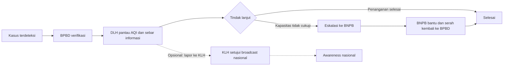

# LUMI

> Layanan informasi lingkungan publik untuk warga Indonesia: memantau kualitas udara dan titik api dari kebakaran lahan, lalu menyampaikannya dengan bahasa yang bisa dipahami semua orang.

**Live demo:** _LINK_DEMO_PROD_DISINI_ <!-- diisi setelah deploy production Vercel berhasil -->

[Nama Lomba — isi manual]

## Masalah & Solusi

Kebakaran lahan dan kabut asap berulang setiap tahun di Kalimantan. Saat kejadian datang, warga sering tahu lebih dulu dari rumor daripada dari informasi resmi: tidak tahu seberapa parah, tidak tahu wilayah mana yang terdampak, tidak tahu apa yang harus dilakukan.

LUMI menutup jurang itu dengan satu alur informasi terkoordinasi: sinyal dari titik pemantauan diverifikasi lintas instansi (DLH, BPBD, BNPB, KLH bersama Diskominfo), lalu diterbitkan ke portal warga sebagai informasi resmi yang jelas, lengkap dengan angka kualitas udara dan saran yang bisa langsung dipraktikkan. Warga juga bisa ikut melapor; laporannya masuk antrean provinsi untuk diverifikasi, bukan hilang di grup chat.

## Fitur per Peran

| Peran | Fitur utama |
| --- | --- |
| **Warga** | Beranda kondisi udara wilayah utama (ISPU, PM2.5, status wilayah), peta nasional dengan filter provinsi dan cluster, lapor kondisi (foto + lokasi) ke BPBD provinsi setempat, profil dengan ganti wilayah utama, tema terang/gelap, ukuran teks besar |
| **BPBD Provinsi** | Peta hotspot nasional (3 tingkat kepercayaan), kotak laporan warga per provinsi, verifikasi & tindakan kasus (verifikasi insiden, catat respons, minta bantuan BNPB) |
| **DLH Provinsi** | Peta ISPU nasional, validasi dampak lingkungan, pemantauan AQI per wilayah, penyebaran informasi warga bersama Diskominfo, penutupan kasus |
| **BNPB** | Peta hotspot nasional, eskalasi bantuan nasional saat kapasitas BPBD provinsi tidak cukup, serah terima kembali ke BPBD |
| **KLH** | Monitoring nasional, persetujuan broadcast awareness lintas provinsi, bantuan nasional saat kasus dilaporkan ke KLH |

## Alur Sistem



## Tech Stack

- **Next.js** (App Router, multi-entry ops/warga/simulator) + React 19
- **Supabase** (Postgres + Auth + RLS) dijalankan lokal via Docker/CLI
- **Server-Sent Events** untuk push pembaruan ke klien
- **Leaflet** + clustering grid untuk peta ISPU dan hotspot
- **pnpm** workspace monorepo, **Playwright** untuk pengujian antarmuka

## Struktur Folder

```text
lumi/
├── apps/
│   └── web/               # Aplikasi Next.js (portal warga, ruang kerja instansi)
├── backend/
│   └── government/        # API + alur kerja lintas instansi
├── packages/
│   └── contracts/         # Kontrak data bersama
├── supabase/
│   ├── migrations/        # Skema database
│   └── tests/             # Uji database
└── scripts/               # Bridge demo lokal, seed, utilitas setup
```

## Menjalankan di Lokal

```bash
pnpm install
pnpm dev
```

`pnpm dev` otomatis menjalankan migrate + seed Supabase lokal, bridge demo (port 3100), aplikasi ops (port 3000), dan portal warga (port 3001). Perintah lain:

```bash
pnpm supabase:start      # hidupkan stack Supabase lokal
pnpm supabase:reset      # reset database lokal
pnpm build               # build semua paket
pnpm test                # uji semua paket
```

## Environment Variables

Nama variable yang dipakai (isi value di `.env.local`, lihat `.env.example` di root dan `apps/web`):

| Variable | Dipakai di | Keterangan |
| --- | --- | --- |
| `DEMO_PASSWORD` | scripts, backend | Kata sandi akun demo (dibuat lokal, jangan di-commit) |
| `LUMI_SESSION_HMAC_KEY` | backend | Kunci HMAC sesi (dibuat lokal) |
| `SUPABASE_URL` | backend | URL Supabase lokal/produksi |
| `SUPABASE_PUBLISHABLE_KEY` | backend | Kunci publik Supabase |
| `SUPABASE_SECRET_KEY` | backend | Kunci rahasia Supabase (server-side saja) |
| `LUMI_DATABASE_URL` | backend | String koneksi database |
| `LUMI_OPS_ORIGIN` | backend | Origin dashboard ops (wajib di produksi) |
| `LUMI_STORAGE` | backend | Penyimpanan: `memory` atau adapter persisten |
| `LUMI_ENTRY` | apps/web | Entry aplikasi: `ops`, `warga`, atau `simulator` |
| `LUMI_DIST_DIR` | apps/web | Direktori build per-entry |
| `NEXT_PUBLIC_LUMI_API_ORIGIN` | apps/web | Origin API (bawaan `http://localhost:4000`) |
| `NEXT_PUBLIC_LUMI_STATE_ORIGIN` | apps/web | Origin bridge demo lokal (bawaan `http://127.0.0.1:3100`) |
| `NEXT_PUBLIC_SUPABASE_URL` | apps/web | URL Supabase untuk klien |
| `NEXT_PUBLIC_SUPABASE_PUBLISHABLE_KEY` | apps/web | Kunci publik Supabase untuk klien |

## Deployment

1. Set environment variables di platform hosting (lihat tabel di atas).
2. Build: `pnpm build` (portal warga dan ops punya entry terpisah via `LUMI_ENTRY`).
3. Deploy. Untuk Vercel: `vercel link` lalu `vercel --prod` agar domain `<project>.vercel.app` tetap stabil, lalu hubungkan repo GitHub di Settings → Git untuk auto-deploy tiap push ke `main`.

## Lisensi

[Lisensi — belum ditentukan]

---

Dibuat dengan ❤️ oleh Verrel · We love NewJeans 🩷
